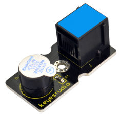
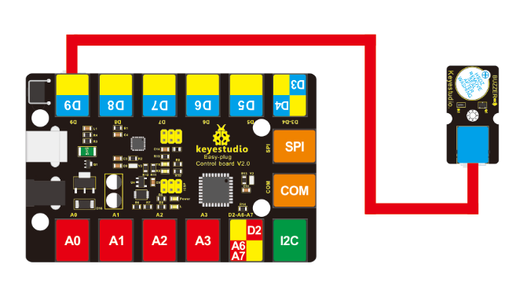
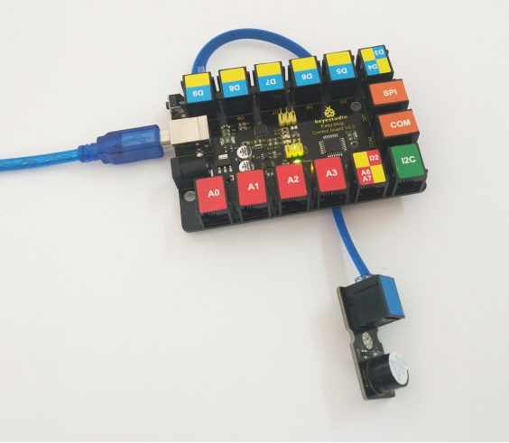

# KS0102 keyestudio EASY plug Active Buzzer Module



## 1. Introduction

Hey want to hear a really loud noise? Apply 3.3V to 5V to this buzzer module and you'll be rewarded with a loud beep.

Here is the simplest sound making module. You can use high/low level to drive it. Just change the frequency it buzzes, you can hear different sound.

It is really great for integrating into projects with this small but useful module. Have a try! You will find the electronic sound it creates so fascinating.

This module is widely used on your daily appliance, like PC, refrigerator, phones, etc.

**Note:** this module should be used together with EASY plug control board.

**Special Note:**

The sensor/module is equipped with the RJ11 6P6C interface, compatible with our keyestudio EASY plug Control Board with RJ11 6P6C interface.

If you have the control board of other brands, it is also equipped with the RJ11 6P6C interface but has different internal line sequence, can’t be used compatibly with our sensor/module.

## 2. Specification

- Sensor type: Digital
- Working voltage: 3.3-5V
- High quality connector

## 3. Technical Details

- Dimensions: 39mm * 20mm * 18mm
- Weight: 6g

## 4. Connect It Up

Connect the EASY Plug active buzzer module to control board using an RJ11 cable. Then connect the control board to your PC with a USB cable.



## 5. Sample Code

Download code:  [Code](./Code.7z)

```c
int buzzPin =9; //Connect Buzzer on Digital Pin 9

void setup()  
{        
  pinMode(buzzPin, OUTPUT);    
}

void loop()                    
{
  digitalWrite(buzzPin, HIGH);
  delay(1);
  digitalWrite(buzzPin, LOW);
  delay(1);        
}
```

## 6. Result

Done uploading the code, you should be able to hear an audible beep. 

